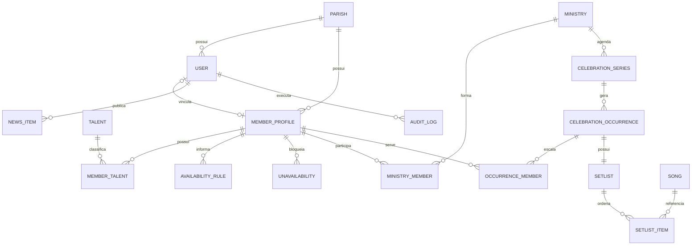
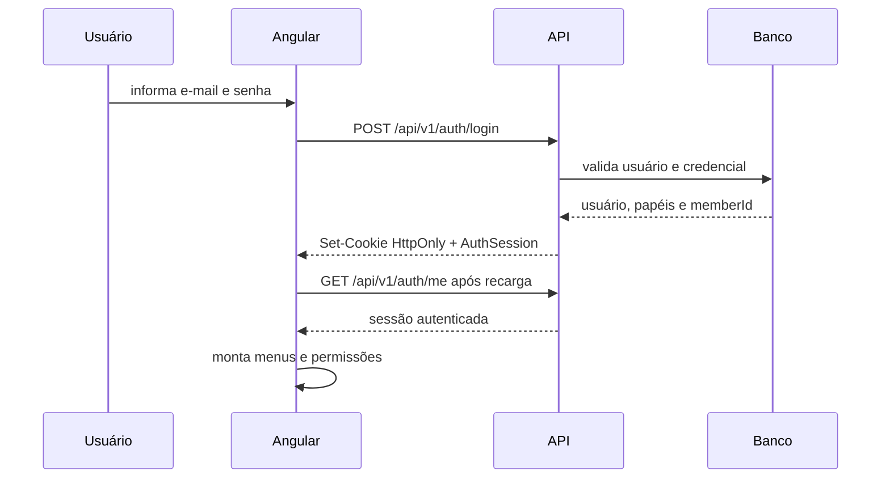
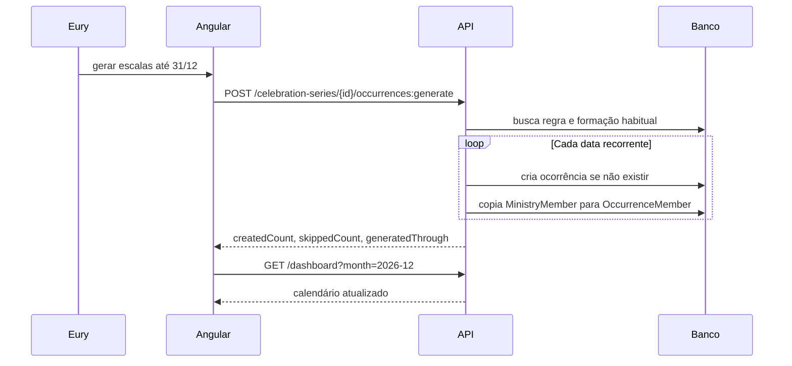

# Contrato de integração do back-end

Este documento traduz o front-end atual do **Música da Glória** em um contrato de
API, autenticação e persistência. A referência executável inicial está em
[`openapi.yaml`](./openapi.yaml).

## 1. Decisões de base

- Base URL: `/api/v1`.
- IDs: UUID gerado pelo servidor.
- Banco recomendado: PostgreSQL.
- Datas instantâneas: ISO 8601 em UTC, por exemplo `2026-10-04T22:00:00Z`.
- Regras recorrentes: horário local e timezone `America/Fortaleza`.
- Exclusão histórica: arquivamento lógico com `status` ou `archivedAt`.
- Escritas retornam a representação atualizada do recurso.
- Listagens usam `page`, `pageSize`, `sort` e filtros explícitos.
- O back-end é a autoridade de autorização; guards do Angular são somente UX.
- Mudança de tom, tamanho de fonte e autorrolagem continuam no cliente e não
  precisam de endpoints.
- O produto nasce para a Paróquia Nossa Senhora da Glória, mas o banco e a API
  são multi-paróquia desde a primeira versão.
- Todo dado pastoral pertence a uma `Parish`; o back-end determina a paróquia
  ativa pela sessão e não confia em um `parishId` arbitrário enviado pelo front.
- O papel `SUPER_ADMIN` é global. `LEADER` e `MEMBER` sempre pertencem a uma
  paróquia e só acessam dados dela.
- Cada `User` pertence a no máximo uma paróquia. A mesma conta não pode participar
  de duas paróquias, e o e-mail de acesso é único em toda a plataforma.
- Uma paróquia pode possuir vários líderes, embora o caso mais comum seja apenas
  um. Nenhum registro de paróquia depende de um único `leaderId`.

## 2. Limites do domínio

O formulário atual de ministério reúne duas coisas na mesma tela, mas o back-end
deve persistir conceitos separados:

1. `Ministry`: nome e formação habitual.
2. `CelebrationSeries`: regra recorrente, título, local, dia da semana, horário e
   timezone.
3. `CelebrationOccurrence`: uma escala concreta gerada para uma data.

A API pode aceitar um DTO agregado na criação do ministério para manter a UX
atual, mas deve salvar `Ministry` e `CelebrationSeries` separadamente.



### Isolamento entre paróquias

As tabelas de domínio devem possuir `parishId` diretamente ou herdá-lo por uma
relação obrigatória. Consultas e escritas de `LEADER` e `MEMBER` sempre recebem o
escopo da paróquia a partir da sessão. O `SUPER_ADMIN` informa o escopo apenas nas
operações globais de administração.

O `SUPER_ADMIN` não possui acesso ordinário a membros, ministérios, escalas,
repertórios ou notícias. Um mecanismo futuro de suporte, se necessário, deverá
exigir motivo, ter duração limitada, avisar a paróquia e produzir auditoria; ele
não faz parte do contrato inicial.

Somente o `SUPER_ADMIN` pode conceder, suspender ou remover o papel `LEADER`. Um
líder não altera outro diretamente: ele abre uma `LeadershipRequest` na área
administrativa, informa o motivo e acompanha a decisão do administrador global.

Um identificador pertencente a outra paróquia deve ser tratado como recurso não
encontrado (`404`), evitando revelar a existência de dados entre paróquias.

### Regra crítica de cópia

Ao gerar uma ocorrência, os `MinistryMember` são copiados para
`OccurrenceMember`. Alterar, remover ou substituir um integrante da ocorrência
nunca altera a formação habitual ou outras datas.

## 3. Autenticação e sessão

### Estratégia recomendada

Usar sessão opaca ou refresh token em cookie `HttpOnly`, `Secure` e
`SameSite=Lax`. O Angular não deve salvar tokens em `localStorage`.

- `POST /auth/login` valida as credenciais e cria a sessão.
- `GET /auth/me` recupera usuário, papel e `memberId` após recarga/SSR.
- `POST /auth/refresh` renova uma sessão expirada, se forem usados access e
  refresh tokens.
- `POST /auth/logout` revoga a sessão e limpa os cookies.
- Requisições mutáveis devem validar CSRF quando autenticação for baseada em
  cookie e a API não estiver restrita ao mesmo site.

### Conta de acesso e membro pastoral

`User` e `MemberProfile` possuem ciclos de vida independentes:

- Eury pode cadastrar uma pessoa no banco de talentos sem conceder acesso;
- esse cadastro cria somente um `MemberProfile` na paróquia;
- quando a pessoa precisar acessar o sistema, a líder envia um convite associando
  o futuro `User` ao `MemberProfile` existente;
- o vínculo `User.memberId` é opcional e, quando preenchido, deve apontar para um
  membro da mesma paróquia;
- `LEADER` herda todas as permissões de consulta de `MEMBER` e pode possuir
  `memberId`, participar de ministérios e aparecer em escalas normalmente;
- desativar a conta não remove nem arquiva automaticamente o membro, e arquivar o
  membro não apaga a conta sem uma decisão administrativa explícita.

### Fluxo de criação de acesso

1. O `SUPER_ADMIN` cadastra a paróquia e envia um convite com papel `LEADER` para
   a pessoa responsável, como Eury.
2. O sistema salva apenas o convite pendente, com validade e token de uso único.
3. Eury recebe o link, confirma seus dados, informa o WhatsApp e define a própria
   senha.
4. Ao aceitar o convite de líder, a API cria atomicamente o `User` e seu
   `MemberProfile` vinculado na paróquia. Por isso o líder já pode ser escalado e
   usar todos os recursos de membro.
5. Depois de autenticada, Eury pode cadastrar membros sem conta de acesso.
6. Quando um membro precisar entrar, Eury seleciona obrigatoriamente o
   `MemberProfile` existente e envia um convite `MEMBER` vinculado a ele.
7. O membro aceita o convite, informa ou confirma seu WhatsApp, define a senha e
   passa a enxergar apenas os recursos permitidos da sua paróquia.

O líder nunca cria, recebe ou visualiza a senha final de outra pessoa. Convites
expirados ou utilizados não podem ser reaproveitados; um novo convite deve ser
emitido.

### Dados de contato do membro

O cadastro inicial feito pelo líder exige nome completo e e-mail; o WhatsApp pode
ser preenchido pelo líder ou permanecer pendente até o aceite do convite. A foto é opcional.
O telefone deve ser normalizado no servidor para o formato E.164, por exemplo
`+5585999999999`, ainda que o front permita digitação formatada.

No detalhe de uma escala, integrantes autenticados da mesma paróquia podem usar a
ação **Falar pelo WhatsApp**. O front monta um link `https://wa.me/{numero}` com
uma mensagem contextual; essa navegação não exige endpoint adicional. O número
não deve aparecer em rotas públicas, logs ou respostas para outra paróquia.

Para `MEMBER`, a API só inclui os contatos quando o usuário autenticado também
está alocado naquela ocorrência. Nesse caso, ele pode ver os contatos dos demais
integrantes daquela escala, independentemente de a celebração ser futura ou
passada. Membros que não pertencem à ocorrência recebem `whatsapp` omitido. O
`LEADER` conserva acesso aos contatos dos membros da própria paróquia para fins de
gestão. Essa regra deve ser aplicada na API; apenas esconder o botão no Angular
não protege o dado.

A foto deve ser enviada como arquivo JPG, PNG ou WebP, com limite inicial de 5 MB.
No mock, o front mantém uma representação local; na API real, `PUT
/members/{memberId}/photo` recebe `multipart/form-data`, armazena o arquivo fora do
banco e devolve a URL ou referência gerenciada.

Suspender um `User` bloqueia somente sua autenticação. O `MemberProfile`, seus
vínculos e suas escalas permanecem intactos. Afastamento pastoral e arquivamento
do membro são comandos separados.



### Resposta de sessão

```json
{
  "user": {
    "id": "b2cfa63a-4ca4-46f4-a160-94c0439e59e3",
    "name": "Rafael Lima",
    "email": "membro@musicadagloria.org.br",
    "role": "MEMBER",
    "initials": "RL",
    "memberId": "57fb0987-da90-42bf-aa77-6c67dc2c2cba"
  }
}
```

### Matriz de autorização

| Capacidade | SUPER_ADMIN | LEADER | MEMBER |
|---|:---:|:---:|:---:|
| Criar e administrar paróquias | Sim | Não | Não |
| Convidar líder para uma paróquia | Sim | Não | Não |
| Solicitar inclusão ou mudança de líder | Não se aplica | Sim | Não |
| Decidir solicitação de liderança | Sim | Não | Não |
| Ler feed, escalas e músicas da paróquia | Não | Sim | Sim |
| Contatar integrante da escala por WhatsApp | Não | Sim | Sim |
| Filtrar escalas pelo próprio `memberId` | Não se aplica | Sim | Sim |
| Gerenciar feed da paróquia | Não | Sim | Não |
| Gerenciar membros e talentos | Não | Sim | Não |
| Gerenciar ministérios e recorrências | Não | Sim | Não |
| Criar e editar ocorrências | Não | Sim | Não |
| Gerenciar repertório e músicas | Não | Sim | Não |
| Convidar membros da paróquia | Não | Sim | Não |
| Auditoria global | Sim | Não | Não |

## 4. Catálogo de endpoints

### Autenticação e usuários

| Método | Endpoint | Papel | Uso |
|---|---|---|---|
| `POST` | `/auth/login` | Público | Entrar |
| `GET` | `/auth/me` | Autenticado | Restaurar sessão |
| `POST` | `/auth/refresh` | Público com cookie | Renovar sessão |
| `POST` | `/auth/logout` | Autenticado | Encerrar e revogar sessão |
| `POST` | `/auth/password/forgot` | Público | Solicitar recuperação |
| `POST` | `/auth/password/reset` | Público com token | Definir nova senha |
| `GET` | `/parishes` | SUPER_ADMIN | Listar paróquias |
| `POST` | `/parishes` | SUPER_ADMIN | Criar paróquia |
| `PATCH` | `/parishes/{id}` | SUPER_ADMIN | Atualizar ou desativar paróquia |
| `GET` | `/users` | SUPER_ADMIN, LEADER | Listar usuários no escopo permitido |
| `POST` | `/users/invitations` | SUPER_ADMIN, LEADER | Convidar usuário sem expor senha |
| `GET` | `/users/invitations` | SUPER_ADMIN, LEADER | Listar convites pendentes e válidos no escopo permitido |
| `POST` | `/users/invitations/{id}/link` | SUPER_ADMIN, LEADER | Gerar novo link e invalidar o anterior |
| `POST` | `/users/invitations/{token}/accept` | Público | Aceitar convite |
| `POST` | `/users/invitations/{id}/resend` | SUPER_ADMIN, LEADER | Invalidar token anterior e reenviar |
| `DELETE` | `/users/invitations/{id}` | SUPER_ADMIN, LEADER | Revogar convite pendente |
| `PATCH` | `/users/{id}` | SUPER_ADMIN, LEADER | Alterar somente papel/status permitido |
| `GET` | `/leadership-requests` | SUPER_ADMIN, LEADER solicitante | Listar solicitações no escopo permitido |
| `POST` | `/leadership-requests` | LEADER | Solicitar inclusão, suspensão ou remoção de líder |
| `PATCH` | `/leadership-requests/{id}/decision` | SUPER_ADMIN | Aprovar ou rejeitar com justificativa |

Regras do convite:

- `SUPER_ADMIN` pode convidar `LEADER` e deve indicar a paróquia;
- enquanto o envio de e-mail não estiver ativo, a criação devolve o link para
  compartilhamento privado; uma consulta posterior gera um novo token, invalida o
  anterior e nunca exige persistir o token em texto puro;
- `LEADER` pode convidar apenas `MEMBER` para a própria paróquia;
- uma paróquia pode ter mais de um `LEADER` ativo;
- somente o `SUPER_ADMIN` concede, suspende ou remove acesso de `LEADER`;
- pedidos feitos por um líder geram uma `LeadershipRequest` e nunca alteram
  permissões antes da aprovação;
- para convidar `MEMBER`, `memberId` é obrigatório e precisa identificar um perfil
  existente, ativo, ainda sem conta e pertencente à mesma paróquia do líder;
- e-mail pendente ou ativo não pode ser duplicado dentro do mesmo escopo;
- o e-mail de login é globalmente único, pois uma conta não pode pertencer a mais
  de uma paróquia;
- o token bruto não deve ser persistido, somente seu hash.

### Solicitação de mudança na liderança

A solicitação registra `parishId`, líder solicitante, tipo, pessoa ou conta alvo,
motivo, status, decisão e timestamps. Os estados iniciais são `PENDING`,
`APPROVED` e `REJECTED`.

- `ADD_LEADER`: informa nome e e-mail da pessoa a ser convidada;
- `SUSPEND_LEADER`: referencia um líder da mesma paróquia;
- `REMOVE_LEADER`: referencia um líder da mesma paróquia.

Ao aprovar `ADD_LEADER`, o sistema cria um convite de líder. Ao aprovar suspensão
ou remoção, aplica a mudança de acesso e registra auditoria. A decisão deve ser
atômica: a solicitação não pode aparecer como aprovada se a alteração falhar.

### Dashboard e notícias

| Método | Endpoint | Papel | Uso no front |
|---|---|---|---|
| `GET` | `/dashboard?month=YYYY-MM` | Autenticado | Resumo e calendário mensal |
| `GET` | `/news?page=1&pageSize=20` | Autenticado | Feed |
| `POST` | `/news` | ADMIN, LEADER | Nova notícia |
| `PATCH` | `/news/{id}` | ADMIN, LEADER | Editar notícia |
| `DELETE` | `/news/{id}` | ADMIN, LEADER | Arquivar notícia |

### Membros e banco de talentos

| Método | Endpoint | Papel | Uso no front |
|---|---|---|---|
| `GET` | `/members?query=&status=&page=` | ADMIN, LEADER | Busca e lista |
| `POST` | `/members` | ADMIN, LEADER | Criar membro |
| `GET` | `/members/{id}` | ADMIN, LEADER | Detalhe |
| `PATCH` | `/members/{id}` | ADMIN, LEADER | Editar dados, talentos e disponibilidade |
| `PUT` | `/members/{id}/photo` | LEADER, próprio usuário | Enviar ou substituir foto |
| `DELETE` | `/members/{id}/photo` | LEADER, próprio usuário | Remover foto |
| `POST` | `/members/{id}/archive` | ADMIN, LEADER | Desativar preservando histórico |
| `GET` | `/talents` | ADMIN, LEADER | Opções normalizadas de talentos |
| `POST` | `/members/{id}/unavailabilities` | ADMIN, LEADER, próprio MEMBER | Bloqueio pontual de agenda |
| `DELETE` | `/members/{id}/unavailabilities/{blockId}` | ADMIN, LEADER, próprio MEMBER | Remover bloqueio futuro |

### Ministérios e recorrências

| Método | Endpoint | Papel | Uso no front |
|---|---|---|---|
| `GET` | `/ministries?status=ACTIVE` | ADMIN, LEADER | Lista de ministérios |
| `POST` | `/ministries` | ADMIN, LEADER | Criar ministério e série padrão |
| `GET` | `/ministries/{id}` | ADMIN, LEADER | Formação habitual e recorrência |
| `PATCH` | `/ministries/{id}` | ADMIN, LEADER | Editar nome/formação futura |
| `POST` | `/ministries/{id}/archive` | ADMIN, LEADER | Arquivar sem apagar escalas |
| `PUT` | `/ministries/{id}/members` | ADMIN, LEADER | Substituir formação habitual |
| `GET` | `/celebration-series?ministryId={id}` | ADMIN, LEADER | Listar regras recorrentes |
| `POST` | `/celebration-series` | ADMIN, LEADER | Criar outra regra de celebração |
| `PATCH` | `/celebration-series/{id}` | ADMIN, LEADER | Alterar apenas gerações futuras |
| `POST` | `/celebration-series/{id}/occurrences:generate` | ADMIN, LEADER | Gerar até uma data limite |

Geração deve ser idempotente. A chave natural mínima é
`seriesId + localDate + localTime`; repetir a chamada retorna itens ignorados, sem
duplicar escalas.

A líder escolhe a data limite da geração, respeitando no máximo 12 meses a partir
da data da solicitação. Para períodos maiores, deve executar uma nova geração.



### Escalas concretas

| Método | Endpoint | Papel | Uso no front |
|---|---|---|---|
| `GET` | `/occurrences?from=&to=&status=&memberId=&ministryId=` | Autenticado | Listar e filtrar escalas |
| `POST` | `/occurrences` | ADMIN, LEADER | Criar escala avulsa |
| `GET` | `/occurrences/{id}` | Autenticado | Detalhe, formação e repertório |
| `PATCH` | `/occurrences/{id}` | ADMIN, LEADER | Data, local, título e orientações |
| `POST` | `/occurrences/{id}/publish` | ADMIN, LEADER | Publicar escala |
| `PUT` | `/occurrences/{id}/members` | ADMIN, LEADER | Substituir formação somente da data |
| `POST` | `/occurrences/{id}/members` | ADMIN, LEADER | Adicionar integrante |
| `DELETE` | `/occurrences/{id}/members/{memberId}` | ADMIN, LEADER | Remover integrante da ocorrência |
| `PATCH` | `/occurrences/{id}/members/{memberId}/confirmation` | Próprio MEMBER, ADMIN, LEADER | Confirmar ou recusar participação |
| `PUT` | `/occurrences/{id}/setlist` | ADMIN, LEADER | Salvar ordem completa do repertório |
| `POST` | `/occurrences/{id}/setlist/items` | ADMIN, LEADER | Adicionar música |
| `PATCH` | `/occurrences/{id}/setlist/items/{itemId}` | ADMIN, LEADER | Alterar tom/momento/observação |
| `DELETE` | `/occurrences/{id}/setlist/items/{itemId}` | ADMIN, LEADER | Remover música |

O filtro do membro deve usar o `memberId` obtido em `/auth/me`. Para `MEMBER`, a
API deve ignorar ou rejeitar um `memberId` de terceiro e sempre aplicar o próprio
vínculo.

Indisponibilidade e conflito com outra escala não impedem definitivamente a ação
da líder. Sem exceção explícita, a API responde `409` com os conflitos encontrados.
A líder pode repetir o comando com `overrideConflicts: true` e uma justificativa
obrigatória. A exceção e sua justificativa devem constar no `AuditLog`.

### Músicas

| Método | Endpoint | Papel | Uso no front |
|---|---|---|---|
| `GET` | `/songs?query=&status=ACTIVE&page=` | Autenticado | Biblioteca e busca |
| `POST` | `/songs` | ADMIN, LEADER | Cadastrar música |
| `GET` | `/songs/{id}` | Autenticado | Letra e cifra |
| `PATCH` | `/songs/{id}` | ADMIN, LEADER | Editar metadados, letra e cifra |
| `POST` | `/songs/{id}/archive` | ADMIN, LEADER | Arquivar preservando setlists |

## 5. DTOs principais

### Criar ministério pela tela atual

```json
{
  "name": "Ministério Santa Cecília",
  "memberIds": ["member-uuid-1", "member-uuid-2"],
  "defaultSeries": {
    "title": "Santa Missa Dominical",
    "location": "Igreja Matriz",
    "weekday": "SUNDAY",
    "localTime": "19:00",
    "timezone": "America/Fortaleza"
  }
}
```

### Gerar escalas

```json
{
  "throughDate": "2026-12-31"
}
```

```json
{
  "createdCount": 12,
  "skippedCount": 2,
  "generatedThrough": "2026-12-31",
  "occurrenceIds": ["occurrence-uuid-1", "occurrence-uuid-2"]
}
```

### Detalhe de ocorrência

```json
{
  "id": "occurrence-uuid",
  "seriesId": "series-uuid",
  "ministry": { "id": "ministry-uuid", "name": "Ministério Santa Cecília" },
  "title": "Santa Missa Dominical",
  "startsAt": "2026-10-04T22:00:00Z",
  "timezone": "America/Fortaleza",
  "location": "Igreja Matriz",
  "liturgicalTime": "Tempo Comum",
  "status": "PUBLISHED",
  "notes": "Chegada às 18h15.",
  "members": [
    {
      "memberId": "member-uuid",
      "name": "Rafael Lima",
      "initials": "RL",
      "role": "Violão",
      "confirmation": "CONFIRMED"
    }
  ],
  "setlist": {
    "items": [
      {
        "id": "item-uuid",
        "position": 1,
        "songId": "song-uuid",
        "title": "Caminho de Luz",
        "key": "G",
        "liturgicalMoment": "Entrada"
      }
    ]
  },
  "version": 3
}
```

## 6. Contrato de erros

Formato único para todas as features:

```json
{
  "type": "https://musicadagloria.org/errors/schedule-conflict",
  "title": "Conflito de agenda",
  "status": 409,
  "code": "MEMBER_SCHEDULE_CONFLICT",
  "detail": "Rafael Lima já está escalado neste horário.",
  "fieldErrors": [],
  "traceId": "01J..."
}
```

Status esperados:

- `400`: comando inválido.
- `401`: sessão ausente ou expirada.
- `403`: papel sem permissão.
- `404`: recurso inexistente ou invisível ao usuário.
- `409`: conflito de agenda, duplicidade ou versão desatualizada.
- `422`: validação de negócio com `fieldErrors`.
- `429`: limite de tentativas, especialmente no login.

Usar `version` ou `ETag/If-Match` para impedir que duas edições silenciosamente
sobrescrevam a mesma escala.

## 7. Mapeamento dos services atuais

| Service do front | Método atual | Endpoint futuro |
|---|---|---|
| `AuthService` | `login` | `POST /auth/login` |
| `AuthFacade` | restauração ainda ausente | `GET /auth/me` |
| `DashboardService` | `getCalendar` | `GET /dashboard?month=` |
| `DashboardService` | `listNews` | `GET /news` |
| `DashboardService` | `saveNews` | `POST/PATCH /news` |
| `MembersService` | `list/getById/create/update/deactivate` | `/members` e `/members/{id}/archive` |
| `MinistriesService` | CRUD e arquivamento | `/ministries` |
| `MinistriesFacade` | `generateUntil` | `/celebration-series/{id}/occurrences:generate` |
| `SchedulesService` | `list/getById/create` | `/occurrences` |
| `SchedulesService` | membros da ocorrência | `/occurrences/{id}/members` |
| `SchedulesService` | repertório da ocorrência | `/occurrences/{id}/setlist` |
| `SongsService` | CRUD | `/songs` |

## 8. Mudanças necessárias no Angular

1. Criar `ApiConfig` em environment com `apiBaseUrl`.
2. Trocar cada implementação mock por repositório HTTP mantendo a API das facades.
3. Adicionar interceptor de credenciais, `traceId` e tratamento de `401`.
4. Inicializar a aplicação com `GET /auth/me` antes de liberar rotas privadas.
5. Substituir nomes soltos por referências: `ministryId`, `memberId` e `songId`.
6. Separar `Ministry` de `CelebrationSeries` nos models internos.
7. Usar `startsAt` no transporte e formatar em `America/Fortaleza` na borda visual.
8. Implementar paginação real sem carregar coleções inteiras.
9. Invalidar/refazer consultas após mutações em vez de compartilhar arrays em memória.
10. Manter transposição e preferências do leitor como estado local.

## 9. Ordem sugerida de implementação do back-end

1. Banco, migrations, seed seguro e auditoria.
2. Autenticação, `/auth/me`, RBAC e convites.
3. Membros, talentos e disponibilidade.
4. Ministérios, formação habitual e séries recorrentes.
5. Ocorrências, geração idempotente e conflitos.
6. Músicas, setlists e publicação de escalas.
7. Dashboard, feed e confirmação do membro.
8. Notificações e substituição gradual dos repositories mockados.

## 10. Critérios de aceite da integração

- Recarregar uma URL privada mantém a sessão via `/auth/me`.
- `MEMBER` recebe `403` ao tentar mutações administrativas pela API.
- Gerar a mesma série duas vezes não duplica ocorrências.
- Editar a formação de uma ocorrência não altera o ministério.
- Arquivar membro, ministério ou música preserva escalas históricas.
- O filtro “Somente minhas escalas” é aplicado pelo `memberId` autenticado.
- A ordem do setlist é estável e navegável por anterior/próxima.
- Conflitos retornam `409` com código de domínio.
- Todas as mutações administrativas produzem `AuditLog`.
